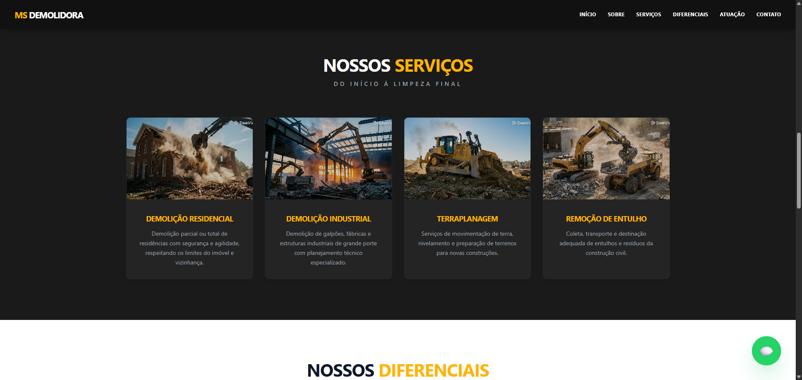

# MS Demolidora - Landing Page Institucional


Landing page desenvolvida para a **MS Demolidora**, focada em apresentar serviços de construção civil com profissionalismo, performance e design responsivo. O projeto serve como portfólio de desenvolvimento Front-end moderno.

## 📸 Prévia do Projeto

| Seção Sobre | Seção de Serviços |
|:---:|:---:|
|  |  |

## 🛠 Tecnologias Utilizadas

- **React (Vite)**: Framework principal para construção da interface e otimização do build.
- **Tailwind CSS**: Estilização utilitária para criação de um design system consistente e responsivo.
- **JavaScript (ES6+)**: Lógica de interação e manipulação do DOM.

## 🚀 Funcionalidades

- **Single Page Application (SPA)**: Navegação fluida sem recarregamento.
- **Design Responsivo**: Layout adaptável para Mobile, Tablet e Desktop.
- **Componentização**: Estrutura de código limpa e reutilizável.
- **Botão Flutuante**: Integração direta com API do WhatsApp para conversão.

## 📦 Como executar o projeto

```bash
# 1. Clone o repositório
git clone [https://github.com/pablobmm/MS_Demolidora.git](https://github.com/pablobmm/MS_Demolidora.git)

# 2. Instale as dependências
npm install

# 3. Rode o projeto
npm run dev
